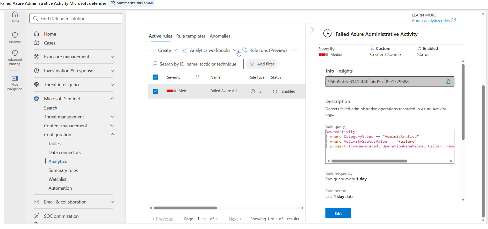
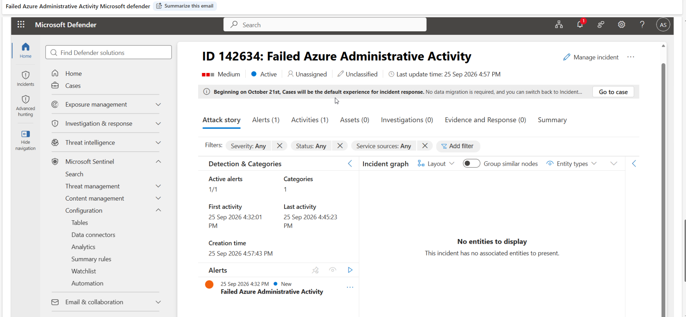
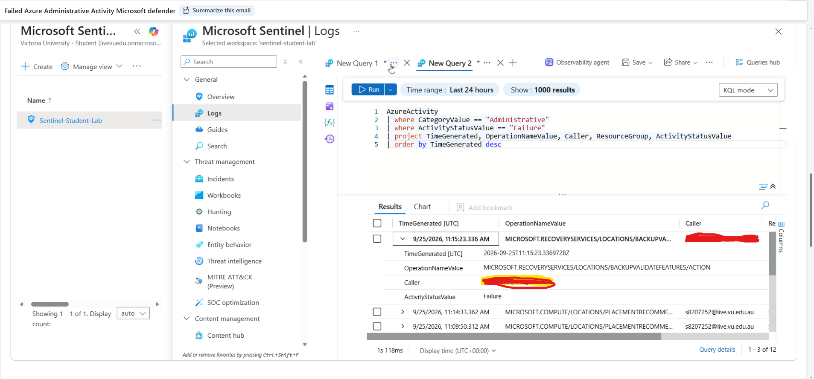
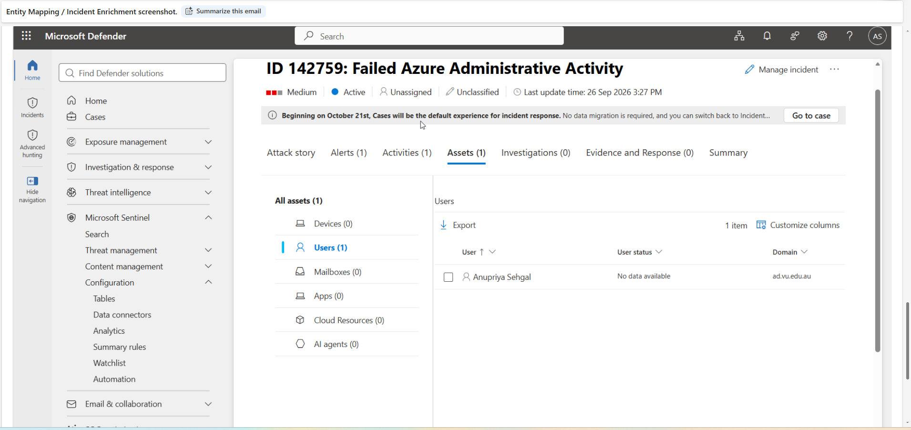
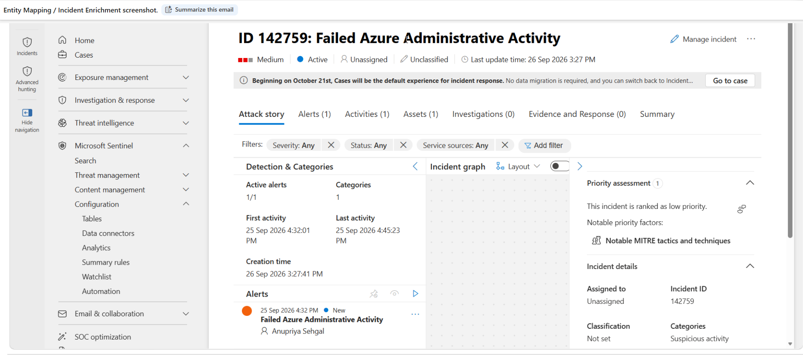
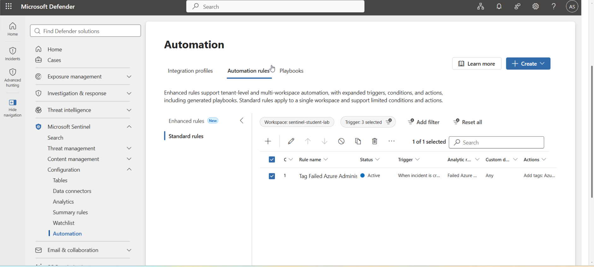
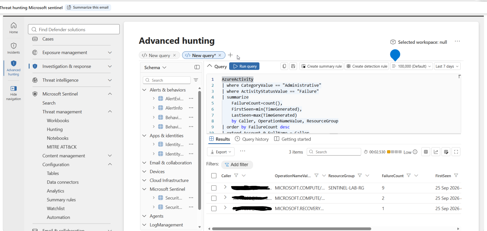
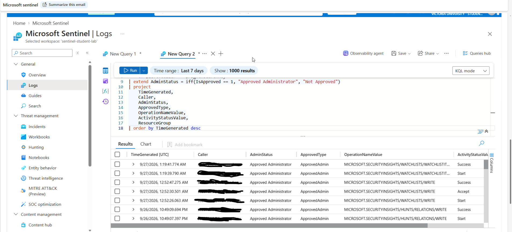

# Microsoft Sentinel SOC Analyst Lab


## Project Overview

This project demonstrates a hands-on Security Operations Center (SOC) lab built using Microsoft Sentinel and Microsoft Defender.

The objective was to develop practical experience with SIEM monitoring, Kusto Query Language (KQL), detection engineering, alert and incident investigation, threat hunting, entity mapping, security automation, and watchlist-based detection tuning.

Azure Activity logs were ingested into a Log Analytics workspace and analyzed using KQL. Custom Scheduled and Near Real-Time (NRT) analytics rules were implemented to detect failed Azure administrative operations. The resulting alerts and incidents were investigated within Microsoft Defender.

The lab was later enhanced with account entity mapping, SOC automation, hypothesis-driven threat hunting, and an Approved Administrators watchlist for detection tuning.

---

## Lab Architecture

```text
Azure Subscription
       |
       v
Azure Activity Logs
       |
       v
Diagnostic Settings
       |
       v
Log Analytics Workspace
       |
       v
Microsoft Sentinel
       |
       +---------------------------+
       |                           |
       v                           v
KQL Detection                 Threat Hunting
       |                           |
       v                           v
Analytics Rules               Hunt Queries
       |
       v
Security Alert
       |
       v
Microsoft Defender Incident
       |
       v
Entity Enrichment
       |
       v
SOC Investigation
       |
       v
Automation & Classification
```

---

## Technologies & Skills

- Microsoft Sentinel
- Microsoft Defender
- Microsoft Azure
- Azure Monitor
- Log Analytics
- Azure Activity Logs
- Kusto Query Language (KQL)
- SIEM
- SOC Monitoring
- Detection Engineering
- Scheduled Analytics Rules
- Near Real-Time Analytics Rules
- Entity Mapping
- Incident Investigation
- Threat Hunting
- Watchlists
- Detection Tuning
- Security Automation
- SOAR concepts
- Incident Classification

---

# 1. Azure Activity Log Ingestion

Azure Activity telemetry was connected to the Microsoft Sentinel workspace through Azure Monitor diagnostic settings.

The data was validated using the `AzureActivity` table.

Example validation query:

```kusto
AzureActivity
| top 50 by TimeGenerated desc
```

This confirmed that Azure administrative events were successfully reaching the Sentinel workspace.

---

# 2. KQL Detection Engineering



A detection query was developed to identify failed Azure administrative operations.

```kusto
AzureActivity
| where CategoryValue == "Administrative"
| where ActivityStatusValue == "Failure"
| project
    TimeGenerated,
    OperationNameValue,
    Caller,
    ResourceGroup,
    ActivityStatusValue
| order by TimeGenerated desc
```

The query provides investigation context including:

- Timestamp
- Initiating account
- Azure operation
- Resource group
- Activity status

### Detection Objective

Identify unsuccessful Azure administrative operations that could represent:

- Configuration problems
- Permission issues
- Unauthorized administrative attempts
- Suspicious management-plane activity

---

# 3. Scheduled Analytics Rule


The tested KQL detection was converted into a custom Scheduled Analytics Rule.

### Rule Name

`Failed Azure Administrative Activity`

### Detection Logic

```kusto
AzureActivity
| where CategoryValue == "Administrative"
| where ActivityStatusValue == "Failure"
| project
    TimeGenerated,
    OperationNameValue,
    Caller,
    ResourceGroup,
    ActivityStatusValue
```

The rule was configured to generate alerts when matching failed administrative operations were detected.

This demonstrated the process of moving from manual log investigation to automated SIEM detection.


### Detection Tuning
The initial detection identifies all failed Azure administrative operations. The tuned version references the ApprovedAdministrators watchlist and excludes known approved administrator accounts, helping reduce expected administrative noise while retaining visibility into activity that may require investigation.
```kusto
let ApprovedAdmins =
    _GetWatchlist('ApprovedAdministrators')
    | project SearchKey;
AzureActivity
| where CategoryValue == "Administrative"
| where ActivityStatusValue == "Failure"
| where Caller !in (ApprovedAdmins)
| project
    TimeGenerated,
    Caller,
    OperationNameValue,
    ResourceGroup,
    ActivityStatusValue
| order by TimeGenerated desc
```kusto

### MITRE ATT&CK Assessment

The `Failed Azure Administrative Activity` detection was reviewed for MITRE ATT&CK mapping.

No specific MITRE ATT&CK technique was assigned because a failed Azure administrative operation alone does not provide sufficient evidence of a specific adversary technique.

Rather than forcing a mapping for coverage purposes, the detection was intentionally left unmapped until additional telemetry or behavioral context could establish a stronger relationship to a documented ATT&CK technique.

This approach helps ensure that MITRE ATT&CK mappings accurately represent the behavior detected and do not overstate detection coverage.
---

# 4. Near Real-Time Detection

A Near Real-Time (NRT) rule was also implemented to gain experience with faster detection workflows.

The NRT exercise demonstrated the difference between traditional scheduled detection and near-real-time monitoring.

```text
Azure Activity Event
        |
        v
Microsoft Sentinel
        |
        v
NRT Detection
        |
        v
Alert
        |
        v
Incident
```

---

# 5. Alert and Incident Generation

The custom analytics rule successfully generated an alert and corresponding incident in Microsoft Defender.

### Incident



`Failed Azure Administrative Activity`

The incident demonstrated an end-to-end detection pipeline:

```text
Azure Activity Log
        |
        v
Log Analytics
        |
        v
KQL Detection
        |
        v
Microsoft Sentinel Analytics Rule
        |
        v
Security Alert
        |
        v
Microsoft Defender Incident
```

---

# 6. Entity Mapping and Incident Enrichment




The original incident did not contain an identified account entity.

To improve investigation context, entity mapping was added to the analytics rule:

```text
Entity: Account
Identifier: FullName
Value: Caller
```

This mapped the `Caller` field from Azure Activity telemetry to a Microsoft Sentinel Account entity.

After updating the rule, subsequent incidents displayed the associated account under incident Assets/Users.

This demonstrated how entity mapping improves SOC investigations by providing identity context directly within incidents.

---

# 7. Incident Investigation and Triage

The generated incident was investigated using Microsoft Defender.

The investigation workflow included:

1. Reviewing the triggering alert.
2. Examining Azure Activity records.
3. Identifying the initiating account.
4. Reviewing mapped entity information.
5. Assigning incident ownership.
6. Documenting investigation findings.
7. Classifying the event.

The event was determined to be authorized activity generated within the controlled lab environment rather than evidence of unauthorized access.

### Investigation Workflow

```text
Alert
   |
   v
Incident
   |
   v
Assign Analyst
   |
   v
Review Evidence
   |
   v
Review Entity
   |
   v
Document Findings
   |
   v
Classify Activity
```

---

# 8. SOC Automation

A Microsoft Sentinel automation rule was implemented to automate incident triage.



### Automation Rule

`Tag Failed Azure Administrative Incidents`

### Trigger

```text
When incident is created
```

### Condition

```text
Analytics rule name contains:
Failed Azure Administrative Activity
```

### Action

```text
Add tag:
Azure-Admin-Failure
```

This demonstrated how automation can help SOC teams consistently categorize incidents and reduce repetitive analyst tasks.

---

# 9. AI-Assisted SOAR Playbook Design

A read-only investigation playbook was designed using the Microsoft Sentinel Playbook Generator.

### Playbook

`Investigate-Azure-Admin-Failure`

The workflow was designed to:

- Read alert details.
- Review alert severity and timestamps.
- Identify available account entities.
- Produce investigation context.
- Avoid destructive remediation actions.

The playbook remained inactive because deployment required additional tenant-level integration permissions that were outside the scope of the student lab environment.

This exercise provided exposure to SOAR workflow design while maintaining a safe, read-only approach.

---

# 10. Threat Hunting

A hypothesis-driven threat hunt was conducted to investigate repeated failed Azure administrative operations.


### Hunt

`Investigation of Repeated Failed Azure Administrative Operations`

### Hypothesis

Repeated failed Azure administrative operations could indicate unauthorized access attempts, suspicious administrative activity, or configuration issues requiring investigation.

### Hunting Query

```kusto
AzureActivity
| where CategoryValue == "Administrative"
| where ActivityStatusValue == "Failure"
| summarize
    FailureCount=count(),
    FirstSeen=min(TimeGenerated),
    LastSeen=max(TimeGenerated)
    by Caller, OperationNameValue, ResourceGroup
| order by FailureCount desc
```

The query correlated:

- Initiating account
- Azure operation
- Resource group
- Failure frequency
- First observed time
- Last observed time

The investigation identified multiple grouped failures, including a grouping containing nine failed operations.

The activity was reviewed and determined to originate from expected configuration activity within the controlled lab environment.

---

# 11. Watchlist-Based Detection Tuning

An `Approved Administrators

